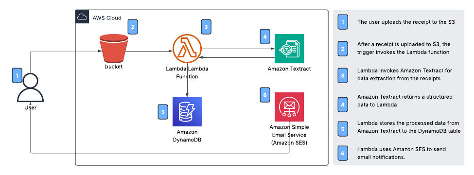

# Automated Receipt Processing

## 🌟 Overview 
This project focuses on automating receipt processing using AWS services. Instead of manually handling receipts which can be time-consuming, error-prone, and difficult to scale—this system extracts structured data from receipts and stores it efficiently for record-keeping and auditing.

The architecture consists of:

* **Storage Layer**: Amazon S3 stores receipt images and PDFs.
* **Processing Layer**: Amazon Textract extracts text from receipts using AI-powered OCR.
* **Database Layer**: DynamoDB stores the extracted data in a structured format.
* **Notification System**: Amazon SES sends email alerts with receipt details.
* **Compute Layer**: AWS Lambda automates the workflow by processing the receipts in real-time.

## 🛠️ Services used
* **Amazon S3**: Stores uploaded receipt images and PDFs. **[Storage]**
* **Amazon Textract**: Extracts text and structured data from scanned receipts. **[AI/ML]**
* **Amazon DynamoDB**: Stores extracted receipt data in a structured format. **[Database]**
* **Amazon SES**: Sends email notifications with extracted receipt details. **[Messaging]**
* **AWS Lambda**: Automates the processing workflow for real-time execution. **[Compute]**
* **IAM Roles & Policies**: Ensures secure access between services. **[Security]**

## ☁️ AWS Architecture

## &rarr; Final Result